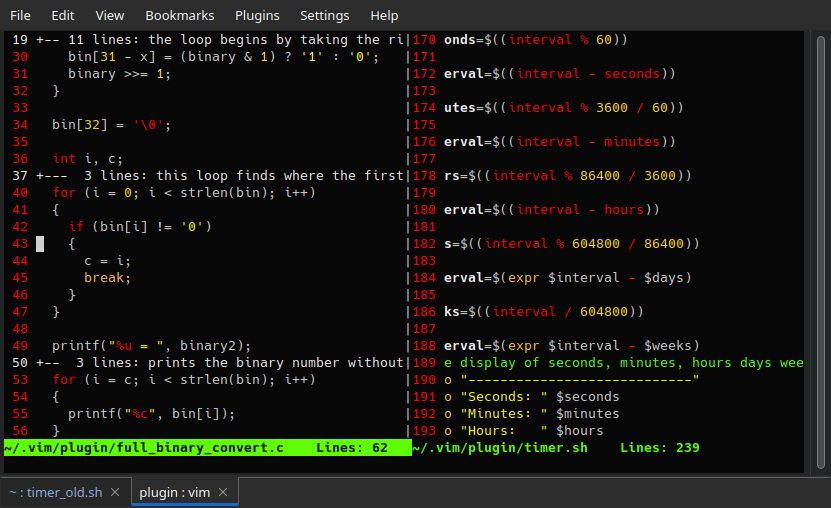

# About

Vim doesn't actually look this choppy when you use my 
color scheme. I pesonally love the way the bright red
contrasts against the black.

# Install for linux/mac

Copy these commands to your terminal:

<pre><code>
mkdir -p ~/.vim/pack/ShinyNeonCalvin/start
cd ~/.vim/pack/ShinyNeonCalvin/start
git clone https://github.com/ShinyNeonCalvin/VimHorror
</pre></code>
